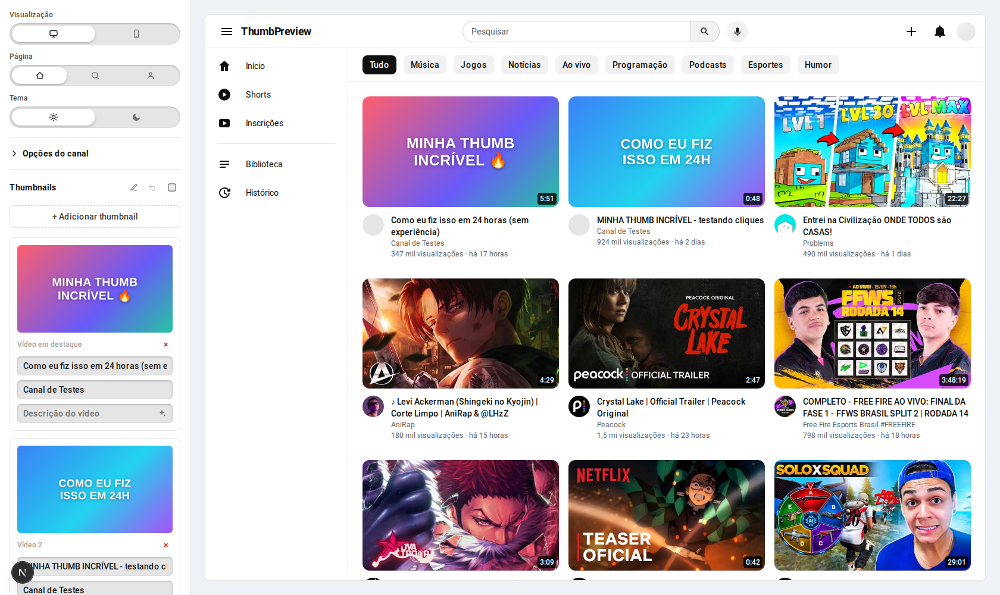
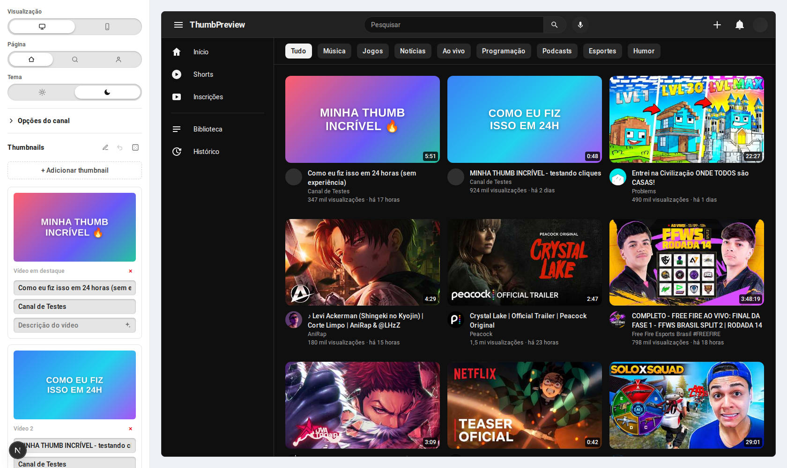
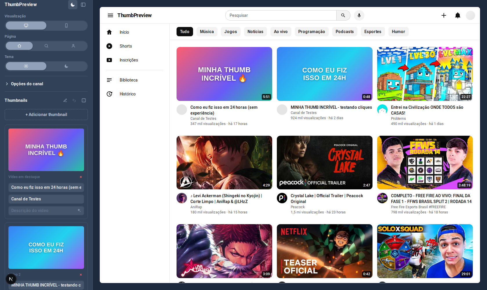
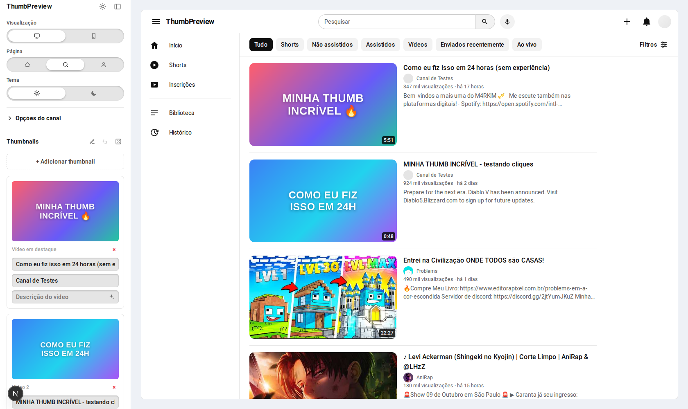
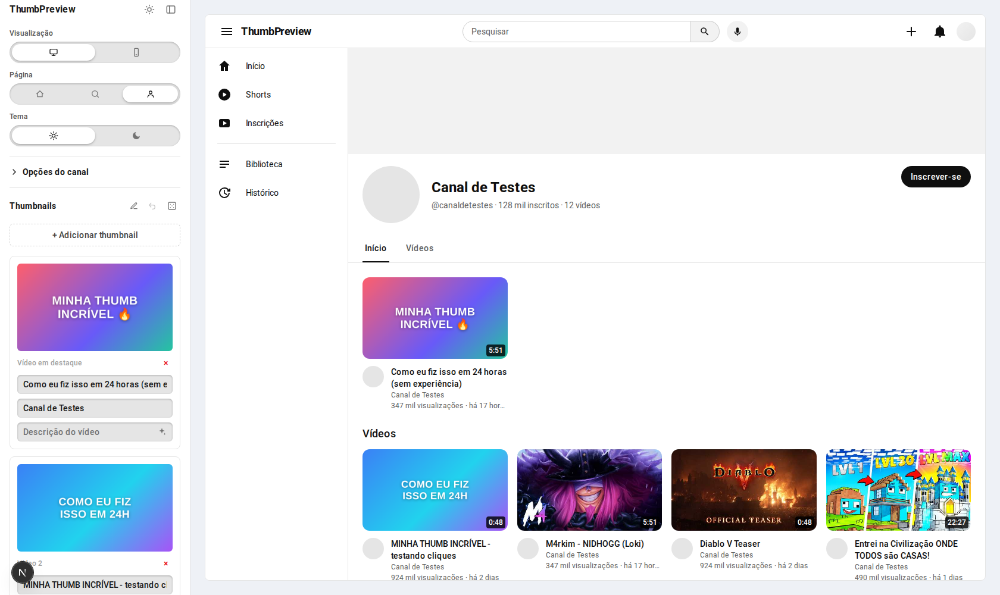
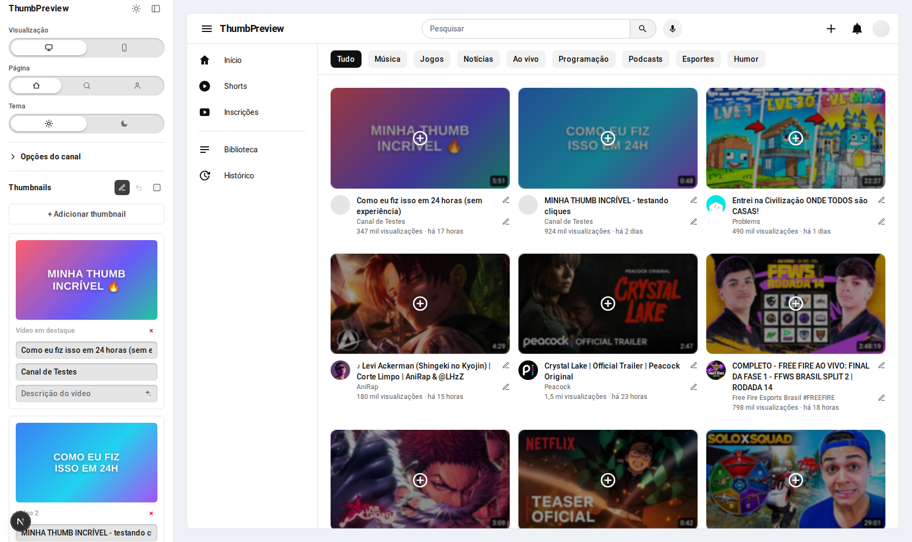
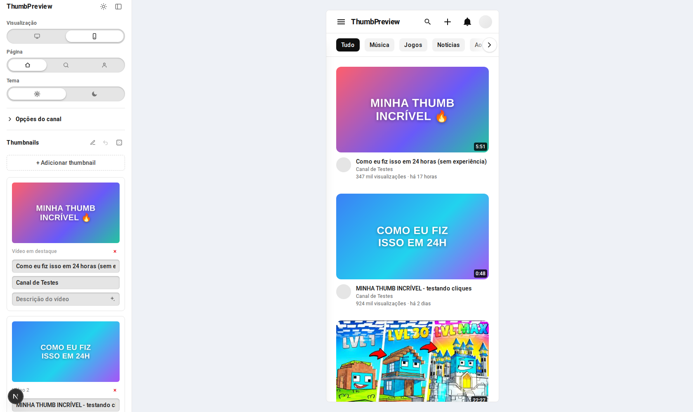

# ThumbPreview

A tool for testing how a thumbnail will look inside YouTube **before** you publish the video. Upload the image, fill in a title/channel, and see the result rendered inside a faithful replica of the YouTube UI — Home, Search and the Channel page, in light/dark theme, desktop/mobile.

100% client-side: no image or data ever leaves your browser. No backend, no database, no login.



## Features

- **Faithful YouTube replica** — Home (video grid), Search (results list) and Channel page (banner, avatar, tabs, featured video), with light/dark theme and desktop/mobile preview.
- **Control panel** on the side, themed independently from the replica — upload several thumbnails, edit each one's title/channel name/description, and configure the channel identity (name, avatar, banner, subscriber count, description).
- **Real filler videos** — with a free YouTube Data API v3 key, the videos surrounding your thumb(s) stop being mocked and become real trending YouTube videos. Without a key, the app automatically falls back to mocked data (faker + picsum).
- **Channel @handle** — enter a real channel's handle (`@channel`) to pull its latest videos as filler on the Channel tab, plus a one-click autofill (✨) button that copies that channel's real name, avatar, subscriber count and description into your test channel.
- **Shuffle (🎲)** — randomizes where your thumb(s) land among all the videos on screen, so you can test how they stand out (or don't) mixed into a real feed. An undo button restores the original order.
- **Edit mode (✏️)** — edit title, channel name and image directly on top of any card in the replica (including filler videos), without touching the main list in the control panel.
- **App theme** — a separate light/dark theme for the tool itself, independent from the theme you're testing inside the YouTube replica.

## Screenshots

<table>
<tr>
<td width="50%">

**Home — dark theme**


</td>
<td width="50%">

**App dark theme (independent from the replica)**


</td>
</tr>
<tr>
<td width="50%">

**Search results**


</td>
<td width="50%">

**Channel page**


</td>
</tr>
<tr>
<td width="50%">

**Edit mode, directly on the cards**


</td>
<td width="50%">

**Mobile preview**


</td>
</tr>
</table>

## Running locally

```bash
npm install
npm run dev
```

Open [http://localhost:3000](http://localhost:3000).

## YouTube Data API integration (optional)

Out of the box, with zero configuration, the app works fully with mocked filler data (faker + picsum) — you don't need to do anything below to try it out. Setting up a free API key upgrades those filler videos to real, currently-trending YouTube content, and unlocks the "@handle" feature that pulls a real channel's own videos.

### 1. Create a Google Cloud project and enable the API

1. Go to the [Google Cloud Console](https://console.cloud.google.com/) and create a new project (or pick an existing one).
2. Open **APIs & Services → Library**, search for **YouTube Data API v3**, and click **Enable**.

### 2. Create and restrict an API key

1. Go to **APIs & Services → Credentials → Create Credentials → API key**. A key is generated immediately — copy it.
2. Click **Edit API key** and set two restrictions (both matter, don't skip them):
   - **API restrictions** → *Restrict key* → select only **YouTube Data API v3**. This stops the key from being usable against any other Google API even if it leaks.
   - **Application restrictions** → *Websites (HTTP referrers)* → add the domain(s) this app will run on, for example:
     - `http://localhost:3000/*` for local development
     - `https://your-deployed-domain.com/*` for production
3. Save.

> **Why the referrer restriction matters:** this app has no backend — the key ships inside the JavaScript bundle sent to every visitor's browser, so anyone can open dev tools and read it. The HTTP-referrer restriction is what actually protects your quota: Google will reject requests that don't come from one of the domains you listed, no matter who holds the key. Never restrict-less-than this, and never commit a real key to the repo.

### 3. Add the key to the project

Copy `.env.example` to `.env.local` and paste your key:

```bash
cp .env.example .env.local
```

```bash
# .env.local
NEXT_PUBLIC_YOUTUBE_API_KEY=your_key_here
```

Restart `npm run dev` after adding or changing this file — Next.js only reads `.env.local` at startup.

### 4. Verify it's working

- Open the app, look at the Home tab: if the filler videos around your thumbnail look like real, currently-trending YouTube videos (real channel names, real view counts) instead of generic faker-generated titles, the key is working.
- If you still see mocked/placeholder-looking videos, open the browser's Network tab and look for requests to `googleapis.com/youtube/v3/...` — `fetchRealFillerVideos`/`fetchChannelByHandle` fail silently and fall back to mocked data on purpose (so a bad key never breaks the app), so the console stays quiet and the failed request itself is the only signal. The most common cause is a `403` from the referrer restriction not matching the URL you're actually testing from (e.g. you added `localhost:3000` but you're on `127.0.0.1:3000`, or a different port).

### 5. Using a specific channel (`@handle`)

In the control panel, open **Channel options → @ (optional)** and type a handle (e.g. `@mkbhd`). Click the sparkle (✨) button next to it to pull that channel's real name, avatar, subscriber count and description, and its latest videos will be added as filler on the Channel tab (in addition to your own uploaded thumbnails, newest-first, capped at 10). The channel must be public and the handle must exist — private, deleted or mistyped handles just fail silently and fall back to generic filler.

### Quota usage

The free daily quota is 10,000 units. This app is very cheap to run against it:

| Action | Cost | Cached for |
|---|---|---|
| Trending filler videos (Home/Search) | ~2 units (1 for videos, 1 for channel avatars) | 6h, in `localStorage` |
| Channel lookup by `@handle` | ~3 units (channel info + uploads + video stats) | 6h per handle, in `localStorage` |

In practice, one visitor triggers at most a handful of units per 6-hour window regardless of how long they keep the tab open, since everything is cached locally after the first fetch.

## Stack

Next.js (App Router) · TypeScript · Tailwind CSS · React Context — no backend, everything lives in memory / `localStorage` in the browser.
